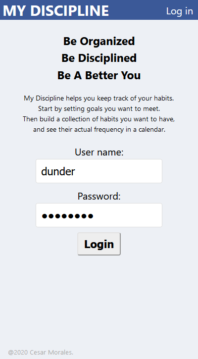
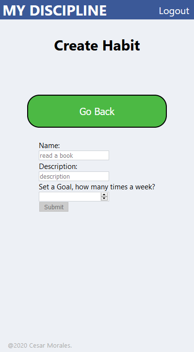
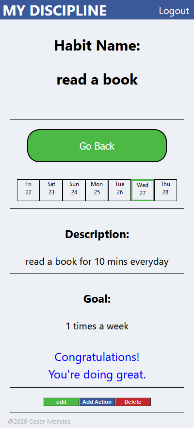
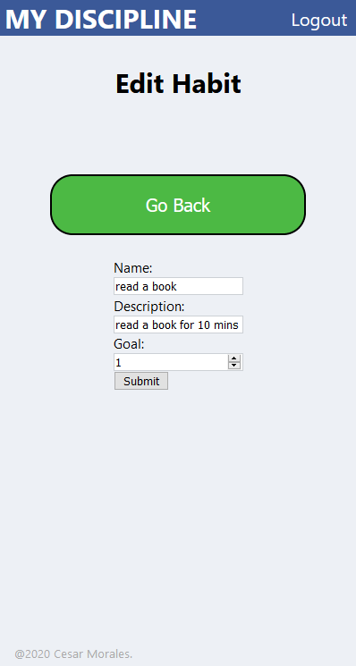
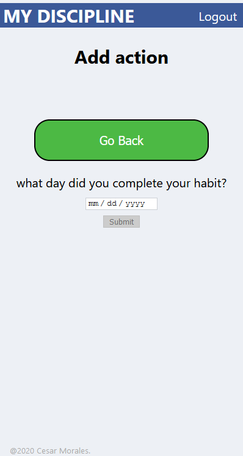

## Application
My Discipline

## Links
live site: [https://my-discipline.now.sh](https://my-discipline.now.sh) 
backend:[https://my-discipline.herokuapp.com/](https://my-discipline.herokuapp.com/) 
Link to Client repo:[https://github.com/cesarlenin/my-discipline](https://github.com/cesarlenin/my-discipline)

## Using The API
Currently the API supports GET, POST, DELETE, and PATCH endpoints.

- Protected Endpoints 
    + Login: POST (https://my-discipline.herokuapp.com/api/auth/login) 
    + GET Habits: GET (https://my-discipline.herokuapp.com/api/habits) 
    + GET Habit: GET (https://my-discipline.herokuapp.com/api/habits/<habit_id>) 
    + POST Habits: POST (https://my-discipline.herokuapp.com/api/habits/) 
    + DELETE Habit:DELETE (https://my-discipline.herokuapp.com/api/habits/<habit_id>) 
    + PATCH Habit:PATCH (https://my-discipline.herokuapp.com/api/habits/<habit_id>) 
    + GET Actions: GET (https://my-discipline.herokuapp.com/api/actions) 
    + POST Action: POST (https://my-discipline.herokuapp.com/api/actions/)

## Screen Shots
 
 
 
 
 
 

### Summary
- My Discipline was created to be a simple way to keep track and organize all of your habits.  
The user starts off by setting goals they want to meet. Then generating a collection of habits they want to have,
and quickly seeing their consistency in a calendar every time they log in.

## Technologies
  - React
  - Node.js
  - JavaScript
  - Postgresql 
  - Mocha, Chai
  - Express
  - Jest
